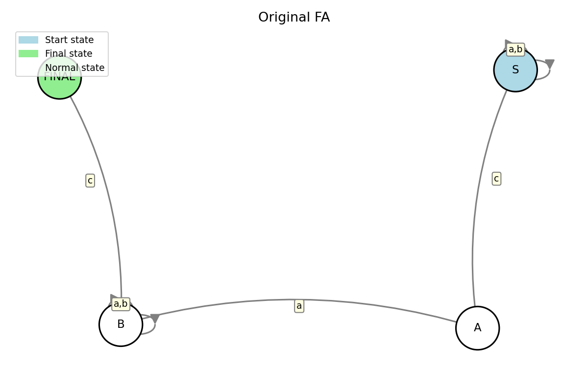
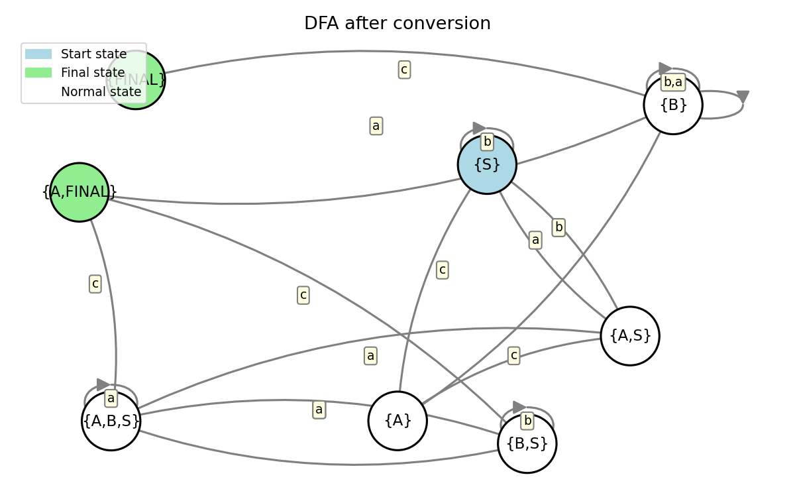

# Determinism in Finite Automata. Conversion from NDFA to DFA. Chomsky Hierarchy.
### Course: Formal Languages & Finite Automata
### Author: Ion Moroșanu 

---

## Theory

A finite automaton is a mathematical model used to represent computational processes. It consists of a finite set of states, an input alphabet, a transition function, a start state, and one or more final states. The automaton reads an input string symbol by symbol and moves between states according to the transition function. If it ends in a final state, the string is accepted.

Automata can be either deterministic (DFA) or non-deterministic (NDFA). In a DFA, every state has exactly one transition for each symbol in the alphabet — the next state is always predictable. In an NDFA, a state can have multiple transitions for the same symbol, or even none at all, meaning several paths can be explored at once. Despite this difference, both models are equivalent in terms of the languages they can recognize — any NDFA can be converted to a DFA using the subset construction algorithm.

The Chomsky hierarchy classifies formal grammars into four types. Type 3 (Regular) grammars are the most restrictive and correspond directly to finite automata. Type 2 (Context-Free) grammars allow more complex rules where a single non-terminal can be replaced by any string. Type 1 (Context-Sensitive) grammars require that productions do not shrink the string. Type 0 (Unrestricted) grammars have no restrictions at all.

---

## Objectives

* Understand what a finite automaton is and what it can be used for.
* Implement a function that classifies a grammar based on the Chomsky hierarchy.
* Implement conversion of a finite automaton to a regular grammar.
* Determine whether a given FA is deterministic or non-deterministic.
* Implement the NDFA to DFA conversion using the subset construction algorithm.
* Represent the finite automaton graphically using an external library.

---

## Implementation description

### Variant 15 — FA definition

The finite automaton used in this lab is derived directly from the Variant 15 grammar. Each production rule of the form `A → aB` maps to a transition where state `A` on symbol `a` moves to state `B`. The production `B → c` maps to a transition that leads to the final state `FINAL`.

```python
transitions = {
    "S": {"a": ["S"], "b": ["S"], "c": ["A"]},
    "A": {"a": ["B"]},
    "B": {"a": ["B"], "b": ["B"], "c": ["FINAL"]},
}
```

### a) FA to Regular Grammar

The conversion iterates over every transition in the FA. For each transition `state --symbol--> target`, if the target is a final state it produces a terminal rule `state → symbol`, otherwise it produces `state → symbol target`. This reconstructs the original right-linear grammar from the automaton structure.

```python
def fa_to_grammar(transitions, finals):
    productions = {}
    for state, sym_map in transitions.items():
        productions[state] = []
        for symbol, targets in sym_map.items():
            for target in targets:
                if target in finals:
                    productions[state].append(symbol)
                else:
                    productions[state].append(f"{symbol}{target}")
    return productions
```

Output:
```
S -> aS | bS | cA
A -> aB
B -> aB | bB | c
```

### b) Determinism check

The function checks every transition in the FA. If any `(state, symbol)` pair leads to more than one state (i.e. the target list has length greater than 1), the automaton is non-deterministic. The original Variant 15 FA is fully deterministic since each state has at most one target per symbol.

```python
def is_deterministic(transitions):
    for state, sym_map in transitions.items():
        for symbol, targets in sym_map.items():
            if len(targets) > 1:
                return False
    return True
```

Output:
```
Is deterministic: True
```

### c) NDFA to DFA conversion

To demonstrate the conversion, a non-deterministic version of the FA was created by giving state `S` two possible targets on symbol `a` — both `S` and `A`. The subset construction algorithm then builds the DFA where each state represents a set of NDFA states. It starts from the initial state set and keeps expanding until no new state sets are discovered.

```python
def ndfa_to_dfa(transitions, start, finals, alphabet):
    def name(fs):
        return "{" + ",".join(sorted(fs)) + "}"

    start_set = frozenset([start])
    unmarked  = [start_set]
    visited   = {start_set}
    dfa_trans = {}
    dfa_finals = set()

    while unmarked:
        current = unmarked.pop()
        dfa_trans[name(current)] = {}
        for symbol in alphabet:
            next_set = set()
            for state in current:
                if state in transitions and symbol in transitions[state]:
                    next_set.update(transitions[state][symbol])
            if not next_set:
                continue
            nf = frozenset(next_set)
            dfa_trans[name(current)][symbol] = [name(nf)]
            if nf not in visited:
                visited.add(nf)
                unmarked.append(nf)
        if current & finals:
            dfa_finals.add(name(current))

    return dfa_trans, name(start_set), dfa_finals
```

The resulting DFA has composite states like `{A,S}`, `{B,S}`, `{A,FINAL}` etc., and is verified to be deterministic after conversion.

### d) Graphical representation

The automaton is drawn using `networkx` for the graph structure and `matplotlib` for rendering. Nodes are colored by role — blue for the start state, green for final states, and white for regular states. Edge labels show the transition symbols. The graph is saved as a PNG file in the same directory as the script.

```python
def draw_fa(transitions, start, finals, alphabet, filename, title):
    G = nx.MultiDiGraph()
    for state in transitions:
        G.add_node(state)
    ...
    plt.savefig(filename, dpi=150)
```

---

## Conclusions / Screenshots / Results

In this lab I worked with the Variant 15 grammar and its corresponding finite automaton. The FA was successfully converted back to a regular grammar, confirming the equivalence between right-linear grammars and finite automata. The determinism check correctly identified the original FA as deterministic.

To demonstrate the NDFA to DFA conversion, a non-deterministic version was created by introducing an extra transition on state `S`. The subset construction algorithm produced a correct DFA where each state is a set of original NDFA states. The resulting DFA was verified to be deterministic.

The grammar was classified as **Type 3 — Regular**, which is expected since all productions follow the right-linear form `A → aB` or `A → a`.

Finally, both the original FA and the converted DFA were represented graphically and saved as PNG images.

**Original FA:**



**DFA after conversion:**



---

## References

1. FCIM UTM — Formal Languages & Finite Automata course page: https://else.fcim.utm.md/course/view.php?id=98